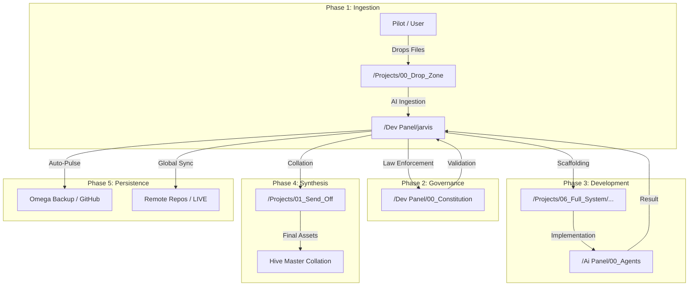

# 🗺️ OMEGA SYSTEM FLOW MAP

This map visualizes the lifecycle of a project within the Tri-Folder Architecture.



### 🧭 Navigation Sovereignty
- **Mission Control**: [Dev Panel](file:///Volumes/Internal/Projects/Omega%20System/Omega%20System%20DEV%20MODE/Dev%20Panel/)
- **Neural Network**: [Ai Panel](file:///Volumes/Internal/Projects/Omega%20System/Omega%20System%20DEV%20MODE/Ai%20Panel/)
- **Production Hub**: [Projects](file:///Volumes/Internal/Projects/Omega%20System/Omega%20System%20DEV%20MODE/Projects/)
```
